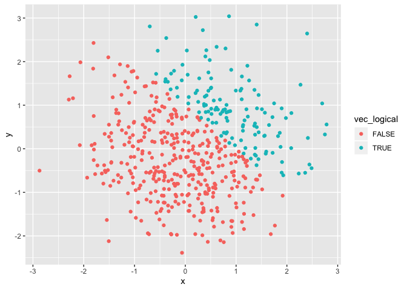
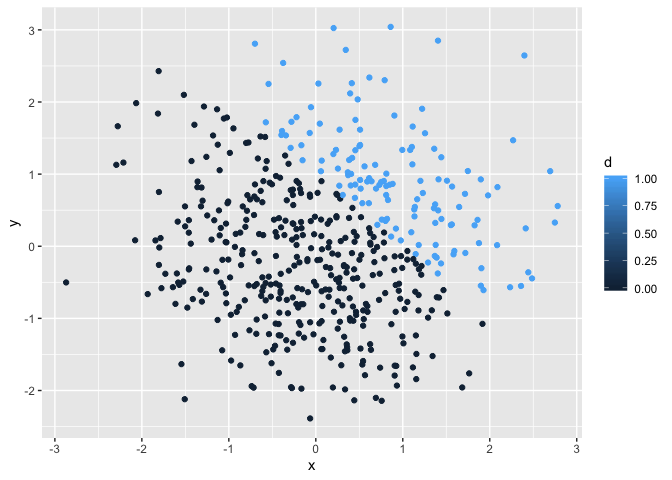
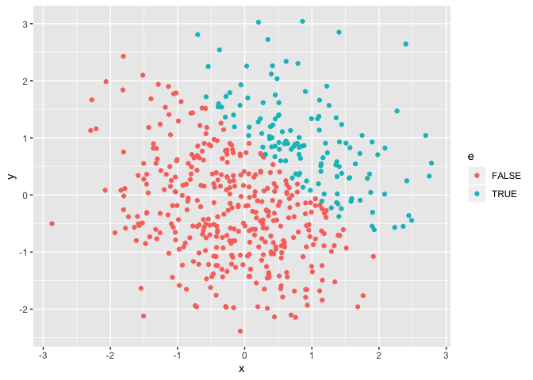

p8105\_hw1\_dj2536
================
Dania Jafar

## R Markdown

This is an R Markdown document. Markdown is a simple formatting syntax
for authoring HTML, PDF, and MS Word documents. For more details on
using R Markdown see <http://rmarkdown.rstudio.com>.

When you click the **Knit** button a document will be generated that
includes both content as well as the output of any embedded R code
chunks within the document. You can embed an R code chunk like
    this:

``` r
library(tidyverse)
```

    ## ── Attaching packages ─────────────────────────────────────────────── tidyverse 1.2.1 ──

    ## ✔ ggplot2 3.2.1     ✔ purrr   0.3.2
    ## ✔ tibble  2.1.3     ✔ dplyr   0.8.3
    ## ✔ tidyr   0.8.3     ✔ stringr 1.4.0
    ## ✔ readr   1.3.1     ✔ forcats 0.4.0

    ## ── Conflicts ────────────────────────────────────────────────── tidyverse_conflicts() ──
    ## ✖ dplyr::filter() masks stats::filter()
    ## ✖ dplyr::lag()    masks stats::lag()

``` r
dataframe = tibble (
  x = rnorm(8),
  vec_logical = x > 0,
  vec_char = c("I'm Dania"),
  vec_factor = factor(c("low", "medium", "high", "low", "medium", "high", "low", "medium")))

mean(pull(dataframe, x))
```

    ## [1] -0.1121705

``` r
mean(pull(dataframe, vec_logical))
```

    ## [1] 0.375

``` r
mean(pull(dataframe, vec_char))
```

    ## Warning in mean.default(pull(dataframe, vec_char)): argument is not numeric
    ## or logical: returning NA

    ## [1] NA

``` r
mean(pull(dataframe, vec_factor))
```

    ## Warning in mean.default(pull(dataframe, vec_factor)): argument is not
    ## numeric or logical: returning NA

    ## [1] NA

\#a random sample of size 8 from a standard Normal distribution \#a
logical vector indicating whether elements of the sample are greater
than 0 \#a character vector of length 8 \#a factor vector of length 8,
with 3 different factor “levels” \# taking the mean of x and
vec\_logical works but it doesn’t work to take the mean of vec\_factor
and vec\_char.

``` r
log_to_num = as.numeric(pull(dataframe, vec_logical))
char_to_num = as.numeric(pull(dataframe, vec_char))
```

    ## Warning: NAs introduced by coercion

``` r
fac_to_num = as.numeric(pull(dataframe, vec_factor))
```

\#I see that that the logical and numeric variables are are able to be
converted to numeric but the character variable is not. This helps to
explain why I got a mean of 0.25 for the mean of the logical variable.
This is because R already has default values of 1 and 0 for true and
false, respectively.

``` r
x = rnorm(8)
a = as.numeric(pull(dataframe, vec_logical)) * x
b = as.factor(pull(dataframe, vec_logical)) * x
```

    ## Warning in Ops.factor(as.factor(pull(dataframe, vec_logical)), x): '*' not
    ## meaningful for factors

``` r
c = as.numeric(b) * x
```

``` r
library(tidyverse)

dataframe2 = tibble(
x = rnorm (500),
y = rnorm (500),
vec_logical = x + y > 1,
d = as.numeric(vec_logical),
e = as.factor(vec_logical)
)
```

## Description of the dataframe

  - The size of the dataframe is 500 and the number of columns are 5  
  - The mean of x is 0.0845442
  - The median of x is 0.0994222
  - The standard deviation of x is 0.9769806
  - The proportion of cases for which x + y \> 1 is 0.266

<!-- end list -->

``` r
# A scatterplot of y vs x
plot1 = ggplot(dataframe2, aes( x = x, y = y)) + 
  geom_point(aes(color = vec_logical))

plot1
```

<!-- --> Since a logical
vector has a value of True or False, the key shows those two values and
they are each given their own color (true = teal and false = coral),
those are the points we see output.

``` r
#A second scatterplot using numeric variables
plot2 = ggplot(dataframe2, aes( x = x, y = y)) + 
  geom_point(aes(color = d))

plot2
```

<!-- --> Here we see a
gradient of color from light blue to dark blue. However, since the the
numeric value of the logical vector is 0 or 1, we just see the colors
for 0 and 1 on the graph, which are light blue and dark blue. We don’t
see the internmediates.

``` r
#A third scatterplot using factor variables
plot3 = ggplot(dataframe2, aes( x = x, y = y)) + 
  geom_point(aes(color = e))

plot3
```

<!-- --> This plot is
essentially the same as the logical vector scatterplot. In this case,
the key shows 0 and 1 instead of false and true, but it corresponds to
the same thing.

``` r
ggsave ("question2.pdf", plot = plot1)
```

    ## Saving 7 x 5 in image
